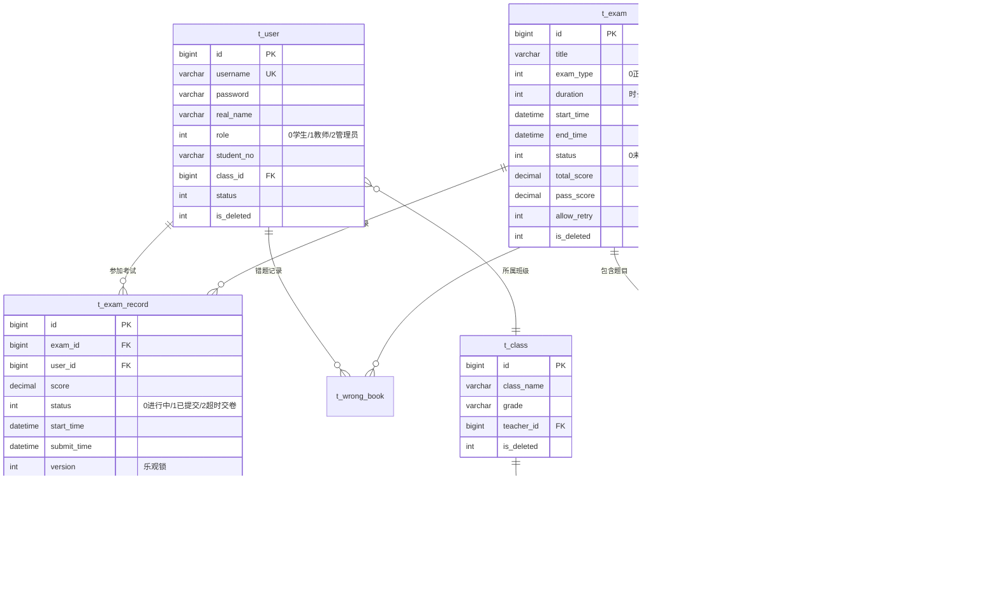

# 📌 智考云在线考试平台 (Zhikaoyun Exam Platform)

> **智考云平台** 是一款基于最新技术栈构建的高效、稳定的前后端分离在线考试系统。旨在为学校、企业及培训机构提供全流程的智能化考核解决方案。

[](https://openjdk.org/)
[](https://spring.io/projects/spring-boot)
[](https://vuejs.org/)
[](https://vitejs.dev/)
[](https://www.mysql.com/)
[](https://element-plus.org/)
[](https://www.typescriptlang.org/)
[](LICENSE)

---

## 📋 目录

- [📖 项目简介](#-项目简介)
- [✨ 核心特性](#-核心特性)
- [🛠️ 技术栈](#️-技术栈)
- [📁 项目结构](#-项目结构)
- [🔧 环境要求](#-环境要求部署-agent-必读)
- [🚀 快速开始](#-快速开始部署-agent-执行顺序)
- [📝 详细部署指南](#-详细部署指南)
- [✅ 部署后验证](#-部署后验证)
- [❌ 常见部署问题排查](#-常见部署问题排查)
- [🗄️ 数据库设计](#️-数据库设计)
- [🌐 API 概览](#-api-概览)
- [🔐 权限体系](#-权限体系)
- [🏗️ 架构设计要点](#️-架构设计要点)
- [📐 开发规范](#-开发规范)
- [👤 默认账号](#-默认账号)
- [🔧 环境变量参考](#-环境变量参考)

---

## 📖 项目简介

智考云是一套 **全功能在线考试平台**，采用前后端分离架构，支持三种用户角色：

| 角色 | 能力 |
|------|------|
| **学生** | 参加考试、查看成绩、错题本复习、个人中心 |
| **教师** | 题库管理、出卷组卷（手动/随机）、发布考试、成绩统计分析 |
| **管理员** | 用户管理、班级管理、全局数据看板、系统日志审计 |

**核心业务流程：** *题库 → 组卷 → 考试 → 答题 → 自动判分 → 成绩分析 → 错题本闭环*

本项目由 8 人团队协作开发，历时 30 天完成全部功能。后端基于 Spring Boot 3.2 + Java 21 构建，管理端采用 Vue 3 + Element Plus，学生端基于 Vue 2 + Element UI，全部模块均已开发完成并可运行。

---

## ✨ 核心特性

- **全方位权限管理**：Spring Security + JWT 无状态认证，前后端路由动态鉴权，支持 `@PreAuthorize` 注解级细粒度控制
- **多元化题型支持**：单选题、多选题、判断题三种题型，支持 Excel 批量导入题库（EasyExcel）
- **智能组卷系统**：手动选题 + 随机组卷（按题型、难度、分类自动抽题），总分自动计算
- **顺畅的答题体验**：前端倒计时 + 后端超时校验双重保障，逐题保存答案，支持乐观锁防重复提交
- **自动判分引擎**：单选/判断直接比较，多选排序后比较（入库时已排序），交卷后自动写入错题本
- **超时自动交卷**：请求时懒检查 + `@Scheduled` 定时任务每分钟扫描，确保不遗漏任何超时记录
- **智能成绩统计**：平均分/最高分/最低分/通过率统计、成绩排名、Excel 导出（EasyExcel）
- **数据看板**：管理员全局统计 + 教师个人数据看板，ECharts 可视化图表展示
- **操作日志审计**：`@Log` 注解 + AOP 切面自动记录所有关键操作到 `t_sys_log`
- **高安全性**：BCrypt 密码加密、CORS 跨域配置、HikariCP 连接池优化、Caffeine 本地缓存

---

## 🛠️ 技术栈

### 后端 (Backend)

| 类别 | 技术 | 版本 |
|------|------|------|
| 核心框架 | Spring Boot | 3.2.5 |
| 编程语言 | Java | 21 |
| 安全框架 | Spring Security + JWT (JJWT) | 0.12.6 |
| 持久层 | MyBatis（手写 SQL + XML Mapper） | 3.0.3 |
| 数据库 | MySQL | 8.0+ |
| 连接池 | HikariCP | — |
| 本地缓存 | Caffeine + Spring Cache | — |
| Excel 处理 | EasyExcel | 3.3.4 |
| 配置加载 | spring-dotenv | 4.0.0 |
| 工具库 | Lombok | — |
| 构建工具 | Maven | 3.6+ |

### 管理端前端 (frontend-admin)

| 类别 | 技术 | 版本 |
|------|------|------|
| 核心框架 | Vue 3 (Composition API + `<script setup>`) | 3.5 |
| 构建工具 | Vite | 8 |
| 编程语言 | TypeScript | 5.9 |
| UI 组件库 | Element Plus | 2.14 |
| 状态管理 | Pinia | 3 |
| 路由 | Vue Router | 5 |
| HTTP 客户端 | Axios | 1.17 |
| 图表库 | ECharts | 6 |
| CSS 方案 | SCSS + UnoCSS（原子化） | — |
| 富文本编辑 | WangEditor | 5.6 |
| 拖拽排序 | vue-draggable-plus | 0.6 |
| 包管理器 | pnpm | — |

### 学生端前端 (frontend-student)

| 类别 | 技术 | 版本 |
|------|------|------|
| 核心框架 | Vue 2 | 2.7 |
| 构建工具 | Vue CLI | 4.5 |
| UI 组件库 | Element UI | 2.15 |
| 状态管理 | Vuex | 3 |
| 路由 | Vue Router | 3 |
| HTTP 客户端 | Axios | 0.19 |
| 包管理器 | npm | — |

---

## 📁 项目结构

```text
Zhikaoyun-Exam-Platform/
├── Backend/                          # 后端 Spring Boot 项目
│   ├── src/main/java/                # Java 业务代码
│   │   └── org.example.zhikaoyunexamplatform/
│   │       ├── ZhikaoyunExamPlatformApplication.java  # 启动类
│   │       ├── config/               # SecurityConfig, CorsConfig, JwtFilter
│   │       ├── common/               # 统一响应, 异常处理, 枚举, 工具类, AOP日志
│   │       ├── user/                 # 用户模块 (注册/登录/CRUD)
│   │       ├── classroom/            # 班级管理模块
│   │       ├── question/             # 题库管理模块 (含 Excel 导入)
│   │       ├── exam/                 # 考试管理模块 (创建/发布/随机组卷)
│   │       ├── record/               # 考试记录模块 (答题/交卷/判分/超时调度)
│   │       ├── score/                # 成绩统计模块 (统计/排名/Excel导出)
│   │       ├── dashboard/            # 首页数据看板
│   │       └── wrongbook/            # 错题本模块
│   ├── src/main/resources/
│   │   ├── application.yaml          # Spring Boot 主配置
│   │   └── mapper/                   # MyBatis XML Mapper 文件
│   ├── docs/                         # 项目文档
│   │   ├── DataBase.sql              # 数据库建表脚本 V5.1
│   │   ├── migration-v1.sql          # 数据迁移脚本
│   │   ├── 智考云API接口文档-V3.md    # API 接口文档
│   │   ├── 项目技术文档.md             # 技术设计文档
│   │   └── openapi.json              # OpenAPI 规范文件
│   ├── .env                          # 环境变量配置
│   ├── .env.example                  # 环境变量示例
│   └── pom.xml                       # Maven 依赖配置
│
├── frontend-admin/                   # 管理端前端 (Vue 3 + Vite + Element Plus)
│   ├── src/
│   │   ├── api/                      # 接口请求层 (auth/business/system)
│   │   ├── components/               # 公共组件 (CURD表格/ECharts/Upload)
│   │   ├── layouts/                  # 布局组件 (Left/Top/Mix)
│   │   ├── router/                   # 路由配置 + 路由守卫
│   │   ├── stores/                   # Pinia 状态管理
│   │   ├── utils/                    # 工具函数 (request.ts/auth.ts)
│   │   └── views/                    # 页面视图
│   │       ├── business/             # 业务页面 (class/exam/question/record/score)
│   │       ├── dashboard/            # 首页仪表盘
│   │       ├── login/                # 登录页
│   │       ├── profile/              # 个人中心
│   │       └── system/               # 系统管理 (用户管理)
│   ├── .env.development              # 开发环境配置
│   ├── .env.production               # 生产环境配置
│   ├── vite.config.ts                # Vite 配置
│   └── package.json
│
├── frontend-student/                 # 学生端前端 (Vue 2 + Vue-CLI + Element UI)
│   ├── src/
│   │   ├── api/                      # 接口请求层
│   │   ├── components/               # 公共组件
│   │   ├── layout/                   # 布局组件
│   │   ├── store/                    # Vuex 状态管理
│   │   ├── utils/                    # 工具函数
│   │   └── views/                    # 页面视图
│   │       ├── exam/                 # 考试答题
│   │       ├── record/               # 考试记录
│   │       ├── question-error/       # 错题本
│   │       ├── login/                # 登录
│   │       ├── register/             # 注册
│   │       └── user-info/            # 用户信息
│   ├── vue.config.js                 # Vue-CLI 配置
│   └── package.json
│
├── pom.xml                           # Maven 父 POM
├── start-frontend.bat                # 前端交互式启动脚本 (Windows)
└── README.md                         # 项目说明文档 (本文件)
```

---

## 🔧 环境要求（部署 agent 必读）

### 版本硬性要求

| 软件 | 最低版本 | 推荐版本 | 说明 |
|------|---------|---------|------|
| JDK | 21 | 21 LTS | Spring Boot 3.2 强制要求 Java 17+，本项目使用 21 |
| Maven | 3.6+ | 3.9+ | 编译后端代码 |
| MySQL | 8.0+ | 8.0+ | 数据库，字符集 utf8mb4 |
| Node.js | 18.0+ | 20 LTS | 管理端前端要求 Node >= 18 |
| pnpm | 8.0+ | 最新 | 管理端前端包管理器 |
| npm | 6.0+ | 最新 | 学生端前端包管理器 (随 Node.js 安装) |

### 端口占用要求

| 服务 | 端口 | 说明 |
|------|------|------|
| 后端 API | `8080` | Spring Boot 服务端口 |
| 管理端前端 | `3000` | Vite 开发服务器 |
| 学生端前端 | `8001` | Vue-CLI 开发服务器 |
| MySQL | `3306` | 数据库默认端口 |

请确保以上端口未被占用，否则启动将失败。

### 磁盘空间要求

| 项目 | 预估大小 |
|------|---------|
| 后端编译产物 (target/) | ~50 MB |
| 管理端 node_modules/ | ~300 MB |
| 学生端 node_modules/ | ~200 MB |
| MySQL 数据库 | ~10 MB |
| **总计** | **~600 MB** |

---

## 🚀 快速开始（部署 agent 执行顺序）

### 执行步骤一览（共 6 步）

```bash
# Step 1: 安装环境依赖（JDK 21, Maven, MySQL 8.0+, Node.js, pnpm）
java -version          # 验证 JDK 21
mvn -version           # 验证 Maven
mysql --version        # 验证 MySQL 8.0+
node -v                # 验证 Node.js >= 18
pnpm -v                # 验证 pnpm

# Step 2: 初始化数据库
mysql -u root -p < Backend/docs/DataBase.sql

# Step 3: 配置并启动后端
cd Backend
# 创建 .env 文件（参考 .env.example）
mvn spring-boot:run

# Step 4: 启动管理端
cd frontend-admin
pnpm install
pnpm dev               # http://localhost:3000

# Step 5: 启动学生端
cd frontend-student
npm install
npm run serve          # http://localhost:8001

# Step 6: 验证部署
# 后端:   curl http://localhost:8080/api/dashboard/overview
# 管理端: 浏览器打开 http://localhost:3000
# 学生端: 浏览器打开 http://localhost:8001
```

> 💡 **快捷方式**：项目根目录提供 `start-frontend.bat` 脚本，可交互式选择启动管理端、学生端或同时启动。

---

## 📝 详细部署指南

### Step 1：安装环境依赖

#### 1.1 安装 JDK 21

从 [Adoptium](https://adoptium.net/) 下载 JDK 21 LTS 并安装。

```bash
java -version
# 期望输出: openjdk version "21.x.x"
```

#### 1.2 安装 Maven

从 [Maven 官网](https://maven.apache.org/download.cgi) 下载并配置环境变量。

```bash
mvn -version
# 期望输出: Apache Maven 3.9.x
```

#### 1.3 安装 MySQL 8.0+

从 [MySQL 官网](https://dev.mysql.com/downloads/mysql/) 下载并安装。安装时记住设置的 root 密码。

```bash
mysql --version
# 期望输出: mysql Ver 8.0.x
```

#### 1.4 安装 Node.js 和 pnpm

从 [Node.js 官网](https://nodejs.org/) 下载 Node.js 20 LTS 安装，然后安装 pnpm：

```bash
node -v                # >= 18.0.0
npm -v                 # >= 6.0.0
npm install -g pnpm    # 安装 pnpm
pnpm -v                # >= 8.0.0
```

---

### Step 2：初始化 MySQL 数据库

#### 2.1 创建数据库并导入建表脚本

```bash
# 登录 MySQL
mysql -u root -p

# 在 MySQL 命令行中执行
CREATE DATABASE exam_system CHARACTER SET utf8mb4 COLLATE utf8mb4_general_ci;
USE exam_system;
SOURCE D:/path/to/Zhikaoyun-Exam-Platform/Backend/docs/DataBase.sql;

# 验证导入
SHOW TABLES;
# 应显示 10 张表：
# t_answer_detail, t_class, t_exam, t_exam_class, t_exam_question,
# t_exam_record, t_question, t_sys_log, t_user, t_wrong_book

SELECT COUNT(*) FROM t_user;
# 应返回预置用户数量
```

#### 2.2 如果遇到问题

- **`SOURCE` 命令不生效**：改用命令行导入 `mysql -u root -p exam_system < Backend/docs/DataBase.sql`
- **中文乱码**：确保数据库字符集为 `utf8mb4`，执行 `SHOW VARIABLES LIKE 'character%';` 检查
- **权限不足**：使用 root 账户操作，或确保目标用户有 `CREATE`、`INSERT` 权限

---

### Step 3：编译并启动后端

#### 3.1 配置环境变量

在 `Backend/` 目录下创建 `.env` 文件（可复制 `.env.example` 并修改）：

```bash
cd Backend
cp .env.example .env
```

编辑 `.env`，至少修改数据库密码：

```env
# 服务端口
SERVER_PORT=8080

# MySQL 数据库（⚠️ 修改为你的实际密码）
DATASOURCE_URL=jdbc:mysql://localhost:3306/exam_system?useUnicode=true&characterEncoding=utf-8&serverTimezone=Asia/Shanghai
DATASOURCE_USERNAME=root
DATASOURCE_PASSWORD=你的MySQL密码

# HikariCP 连接池
HIKARI_MIN_IDLE=5
HIKARI_MAX_POOL_SIZE=20
HIKARI_IDLE_TIMEOUT=300000
HIKARI_MAX_LIFETIME=1200000
HIKARI_CONN_TIMEOUT=30000

# JWT（⚠️ 生产环境请替换为随机密钥：openssl rand -base64 32）
JWT_SECRET=your-256-bit-secret-key-here-must-be-long-enough
JWT_EXPIRATION=86400000

# 日志
LOG_LEVEL=DEBUG
```

#### 3.2 编译并启动

```bash
cd Backend

# 编译（首次运行会自动下载依赖，可能需要几分钟）
mvn clean compile

# 启动
mvn spring-boot:run
```

启动成功后，控制台将输出类似：

```
Started ZhikaoyunExamPlatformApplication in X.XXX seconds
Tomcat started on port 8080
```

#### 3.3 后端启动常见问题

| 问题 | 原因 | 解决方案 |
|------|------|---------|
| `Access denied for user 'root'` | 数据库密码错误 | 检查 `.env` 中 `DATASOURCE_PASSWORD` |
| `Unknown database 'exam_system'` | 数据库未创建 | 执行 Step 2 初始化数据库 |
| `Port 8080 already in use` | 端口被占用 | 修改 `.env` 中 `SERVER_PORT` 或关闭占用程序 |
| `Unsupported class file major version 65` | JDK 版本过低 | 安装 JDK 21 |
| Maven 依赖下载缓慢 | 默认镜像慢 | 配置阿里云 Maven 镜像 |

---

### Step 4：安装依赖并启动管理端

#### 4.1 安装依赖

```bash
cd frontend-admin
pnpm install
```

#### 4.2 开发模式启动

```bash
pnpm dev
```

启动成功后，浏览器自动打开 `http://localhost:3000`，Vite 已将 `/api` 请求代理到后端 `localhost:8080`。

#### 4.3 生产构建

```bash
pnpm build
```

构建产物输出到 `dist/` 目录，可部署到 Nginx 等 Web 服务器。

#### 4.4 验证管理端是否正常运行

- 浏览器访问 `http://localhost:3000`，应显示登录页面
- 使用管理员账号 `wugaoqi / 123456` 登录
- 登录后应看到首页数据看板，侧边栏包含：用户管理、班级管理、题库管理、考试管理、考试记录、成绩管理

---

### Step 5：安装依赖并启动学生端

#### 5.1 安装依赖

```bash
cd frontend-student
npm install
```

#### 5.2 开发模式启动

```bash
npm run serve
```

启动成功后，访问 `http://localhost:8001`。Vue-CLI 已将 `/api` 请求代理到后端 `localhost:8080`。

#### 5.3 生产构建

```bash
npm run build
```

构建产物输出到 `student/` 目录。

#### 5.4 验证学生端是否正常运行

- 浏览器访问 `http://localhost:8001`，应显示登录页面
- 使用学生账号 `huangxin / 123456` 登录
- 登录后应看到可参加的考试列表
- 可以注册新的学生账号

---

## ✅ 部署后验证

### 验证清单

#### 1. 后端 API 验证

```bash
# 验证后端是否启动
curl http://localhost:8080/api/user/login \
  -H "Content-Type: application/json" \
  -d '{"username":"wugaoqi","password":"123456"}'

# 期望返回：
# {"code":200,"msg":"登录成功","data":{"token":"eyJ...","role":2,"username":"wugaoqi",...}}
```

#### 2. 管理端验证

| 检查项 | 预期结果 |
|--------|---------|
| 访问 `http://localhost:3000` | 显示登录页面 |
| 管理员登录 | 成功进入首页数据看板 |
| 用户管理 | 可查看/新增/编辑/删除用户 |
| 题库管理 | 可查看/新增/编辑题目，支持 Excel 导入 |
| 考试管理 | 可创建考试、手动/随机组卷、发布/结束考试 |
| 成绩管理 | 可查看成绩列表、统计数据、导出 Excel |

#### 3. 学生端验证

| 检查项 | 预期结果 |
|--------|---------|
| 访问 `http://localhost:8001` | 显示登录页面 |
| 学生登录 | 成功进入首页，显示可参加的考试 |
| 参加考试 | 可进入考试、答题、提交 |
| 考试记录 | 可查看历史考试记录和答题详情 |
| 错题本 | 交卷后错题自动写入错题本 |
| 注册功能 | 新学生可以注册账号 |

---

## ❌ 常见部署问题排查

### 后端问题

| 问题 | 排查步骤 |
|------|---------|
| 启动报 `BeanCreationException` | 检查 `.env` 数据库配置是否正确，MySQL 是否已启动 |
| 接口返回 403 | Spring Security 配置问题，检查 `SecurityConfig` 中的路由权限 |
| JWT Token 无效 | 检查 `.env` 中 `JWT_SECRET` 长度是否足够（至少 32 字符） |
| MyBatis Mapper 报错 | 检查 `src/main/resources/mapper/` 下的 XML 文件是否存在且格式正确 |
| `java.net.BindException` | 端口 8080 被占用，执行 `netstat -ano \| findstr 8080` 查找占用进程 |

### 管理端问题

| 问题 | 排查步骤 |
|------|---------|
| `pnpm: command not found` | 执行 `npm install -g pnpm` 安装 |
| 依赖安装失败 | 删除 `node_modules/` 和 `pnpm-lock.yaml`，重新 `pnpm install` |
| 登录后无法访问接口 | 确认后端已启动（`http://localhost:8080`），检查 Vite 代理配置 |
| 页面白屏 | 检查浏览器控制台错误，清除缓存刷新 |
| 401 未授权 | Token 过期（有效期 24h），清除 localStorage 重新登录 |

### 学生端问题

| 问题 | 排查步骤 |
|------|---------|
| `node-sass` 安装失败 | 确保 Node.js 版本与 node-sass 兼容，或尝试 `npm rebuild node-sass` |
| 端口 8001 被占用 | 修改 `vue.config.js` 中的 `devServer.port` |
| 接口请求 404 | 检查 `vue.config.js` 的 proxy 配置，确认后端运行在 8080 端口 |
| Element UI 样式异常 | 检查是否正确引入 Element UI 的 CSS |

---

## 🗄️ 数据库设计

系统共 **10 张业务表**，数据库名 `exam_system`，字符集 `utf8mb4`。



### 表结构总览

| 表名 | 说明 | 关键特性 |
|------|------|---------|
| `t_user` | 用户表（学生/教师/管理员三合一） | BCrypt 加密密码，role 字段区分角色 |
| `t_class` | 班级表 | 关联教师，支持年级分类 |
| `t_question` | 题库表 | 单选/多选/判断，支持难度和分类筛选 |
| `t_exam` | 考试表 | 状态流转（未发布→进行中→已结束），支持重试 |
| `t_exam_question` | 考试-题目关联表 | 记录每题分值和排序 |
| `t_exam_class` | 考试-班级关联表 | 限定考试可见范围 |
| `t_exam_record` | 考试记录表 | version 乐观锁防重，支持超时自动交卷 |
| `t_answer_detail` | 答题详情表 | 每题答案、是否正确、得分 |
| `t_wrong_book` | 错题本表 | 自动记录错题，支持标记已掌握 |
| `t_sys_log` | 系统操作日志 | AOP 自动记录，含 IP、耗时、参数 |

### 设计特点

- **逻辑删除**：所有表使用 `is_deleted` 字段，查询时 `WHERE is_deleted = 0`
- **时间字段**：`create_time` 和 `update_time` 在 SQL 中用 `NOW()` 手动填充
- **密码安全**：统一使用 BCrypt 加密
- **复合索引**：如 `t_exam_record` 的 `idx_status_start_time` 供定时任务扫描超时
- **预置数据**：建表脚本中包含管理员、教师、学生等测试账号

---

## 🌐 API 概览

系统共提供 **46 个 RESTful 接口**，统一前缀 `/api`，统一响应格式：

```json
{
  "code": 200,
  "msg": "success",
  "data": {}
}
```

### 接口模块总览

| 模块 | 前缀 | 接口数 | 说明 |
|------|------|--------|------|
| 用户管理 | `/api/user` | 10 | 注册/登录/CRUD/修改密码/重置密码/分页 |
| 班级管理 | `/api/class` | 6 | CRUD + 学生列表 + 成绩汇总 |
| 题库管理 | `/api/question` | 7 | CRUD + 5种筛选 + Excel批量导入 + 引用检查 |
| 考试管理 | `/api/exam` | 10 | CRUD + 发布/结束 + 题目关联 + 随机组卷 |
| 考试记录 | `/api/record` | 8 | 可参加考试/进入考试/答题/提交/记录/详情 |
| 成绩统计 | `/api/score` | 4 | 成绩列表 + 统计 + 排名 + Excel导出 |
| 数据看板 | `/api/dashboard` | 1 | 首页概览数据（管理员全局/教师个人） |
| 错题本 | `/api/wrong-book` | 3 | 错题列表 + 标记掌握 + 删除 |

### 核心接口速查

```
POST   /api/user/login              # 用户登录
POST   /api/user/register           # 学生注册
GET    /api/user/page               # 用户分页列表
POST   /api/user                    # 新增用户
PUT    /api/user/{id}               # 编辑用户
DELETE /api/user/{id}               # 删除用户

GET    /api/class/list              # 班级列表
POST   /api/class                   # 新增班级
PUT    /api/class/{id}              # 编辑班级
DELETE /api/class/{id}              # 删除班级

GET    /api/question/page           # 题库分页
POST   /api/question                # 新增题目
PUT    /api/question/{id}           # 编辑题目
DELETE /api/question/{id}           # 删除题目
POST   /api/question/import         # Excel批量导入

GET    /api/exam/page               # 考试分页
POST   /api/exam                    # 创建考试
PUT    /api/exam/{id}               # 编辑考试
POST   /api/exam/{id}/publish       # 发布考试
POST   /api/exam/{id}/end           # 结束考试
POST   /api/exam/{id}/random        # 随机组卷

GET    /api/record/available        # 可参加的考试
POST   /api/record/{examId}/enter   # 进入考试
POST   /api/record/{id}/answer      # 保存答案
POST   /api/record/{id}/submit      # 提交交卷
GET    /api/record/my               # 我的考试记录

GET    /api/score/exam/{id}         # 成绩列表
GET    /api/score/stat/{examId}     # 成绩统计
GET    /api/score/rank/{examId}     # 成绩排名
GET    /api/score/export/{examId}   # Excel导出

GET    /api/dashboard/overview      # 首页数据看板

GET    /api/wrong-book/list         # 错题本列表
PUT    /api/wrong-book/{id}/master  # 标记已掌握
DELETE /api/wrong-book/{id}         # 删除错题
```

> 📖 完整 API 文档请参阅 [`Backend/docs/智考云API接口文档-V3.md`](Backend/docs/智考云API接口文档-V3.md)

---

## 🔐 权限体系

### 角色定义

| 角色值 | 角色名 | 路由标识 | 权限范围 |
|--------|--------|----------|---------|
| 0 | 学生 | STUDENT | 参加考试、查看成绩、错题本、个人中心 |
| 1 | 教师 | TEACHER | 题库管理、考试管理、成绩统计、数据看板 |
| 2 | 管理员 | ADMIN | 全部权限 + 用户管理 + 班级管理 + 系统日志 |

### 认证机制

- **JWT 无状态认证**：登录成功后返回 Token（有效期 24 小时），前端存储于 `localStorage`
- **请求鉴权**：Axios 拦截器自动附加 `Authorization: Bearer <token>` 请求头
- **401 自动跳转**：Token 过期或缺失时，前端拦截器自动清除 Token 并跳转登录页
- **路由级权限**：`router/index.ts` 中 `meta.roles` 数组控制页面可见性
- **按钮级权限**：`v-hasPerm` 自定义指令或 `hasRole()` 函数控制按钮显示

### 后端权限控制

```java
// Spring Security 路由级权限
.antMatchers("/api/user/page").hasAnyRole("ADMIN")
.antMatchers("/api/question/**").hasAnyRole("TEACHER", "ADMIN")
.antMatchers("/api/exam/**").hasAnyRole("TEACHER", "ADMIN")

// 方法级权限注解
@PreAuthorize("hasAnyRole('TEACHER', 'ADMIN')")
```

---

## 🏗️ 架构设计要点

### 核心业务机制

| 机制 | 实现方案 | 说明 |
|------|---------|------|
| **考试计时** | 前端倒计时 + 后端提交时校验 (`start_time + duration`) | 双重保障防止作弊 |
| **超时交卷** | 方案A：请求时懒检查 + 方案B：`@Scheduled` 定时任务每分钟扫描 | 确保不遗漏超时记录 |
| **防重复提交** | `t_exam_record.version` 乐观锁 | 同一考试只能提交一次 |
| **判分逻辑** | 单选/判断直接比较，多选排序后比较 | 入库时已对多选答案排序 |
| **错题本** | 交卷判分后自动写入 `t_wrong_book` | 已存在则 `wrong_count+1` |
| **操作日志** | `@Log` 注解 + `LogAspect` AOP 切面 | 自动记录到 `t_sys_log` |
| **缓存策略** | Caffeine 本地缓存（替代 Redis） | 适合中小规模部署场景 |
| **逻辑删除** | `is_deleted` 字段，手动 `WHERE is_deleted = 0` | 数据可恢复 |

### 请求处理流程

```
客户端请求
  → Vite/Vue-CLI 代理 (/api → localhost:8080)
    → JwtAuthenticationFilter (Token 解析)
      → SecurityConfig (路由权限校验)
        → Controller (@PreAuthorize 方法权限)
          → Service (业务逻辑)
            → MyBatis Mapper (SQL 执行)
              → MySQL 数据库
```

---

## 📐 开发规范

### 后端

- **统一返回**：所有接口必须 `return Result.success(data)` 或 `return Result.error(msg)`
- **异常处理**：业务异常用 `throw new BusinessException(msg)`，不要 try-catch 吞异常
- **JWT 工具**：`JwtUtils` 是 Spring Bean，必须注入后调用（非静态方法）
- **多选题答案**：入库前必须排序 `"BA" → "AB"`，否则判分出错
- **逻辑删除**：查询时手动加 `WHERE is_deleted = 0`，删除时手动设 `is_deleted = 1`
- **时间字段**：`createTime` 和 `updateTime` 在 SQL 中用 `NOW()` 手动填充
- **权限控制**：教师/管理员接口用 `@PreAuthorize("hasAnyRole('TEACHER', 'ADMIN')")`

### 管理端

- 使用 `<script setup lang="ts">` 语法，不写 Options API
- 所有接口调用通过 `src/api/` 模块，不在页面直接写 axios
- 错误提示由拦截器统一处理，页面只需 try/catch 防止阻塞
- 新增页面放在 `src/views/business/` 对应目录下
- 优先使用 Element Plus 和项目已有组件

### 学生端

- 使用 Vue 2 Options API 风格
- API 接口定义在 `src/api/` 目录
- Element UI 组件库提供 UI 支持

---

## 👤 默认账号

| 账号 | 密码 | 角色 | 说明 |
|------|------|------|------|
| `can` | `123456` | 管理员 | 系统管理、用户管理、全局配置 |
| `teacher01` | `123456` | 教师 | 题库管理、出卷组卷、成绩统计 |
| `wangyu` | `123456` | 学生 | 参加考试、查看成绩、错题本 |


---

## 🔧 环境变量参考

### 后端环境变量（`Backend/.env`）

| 变量名 | 默认值 | 说明 |
|--------|--------|------|
| `SERVER_PORT` | `8080` | 服务端口 |
| `DATASOURCE_URL` | `jdbc:mysql://localhost:3306/exam_system?...` | 数据库连接 URL |
| `DATASOURCE_USERNAME` | `root` | 数据库用户名 |
| `DATASOURCE_PASSWORD` | — | 数据库密码（**必填**） |
| `HIKARI_MIN_IDLE` | `5` | 连接池最小空闲数 |
| `HIKARI_MAX_POOL_SIZE` | `20` | 连接池最大连接数 |
| `HIKARI_IDLE_TIMEOUT` | `300000` | 空闲连接超时（毫秒） |
| `HIKARI_MAX_LIFETIME` | `1200000` | 连接最大生存时间（毫秒） |
| `HIKARI_CONN_TIMEOUT` | `30000` | 获取连接超时（毫秒） |
| `JWT_SECRET` | — | JWT 签名密钥（**生产环境必须替换**） |
| `JWT_EXPIRATION` | `86400000` | Token 有效期（毫秒，默认 24 小时） |
| `LOG_LEVEL` | `DEBUG` | 日志级别 |

### 管理端环境变量（`frontend-admin/.env.development`）

| 变量名 | 默认值 | 说明 |
|--------|--------|------|
| `VITE_APP_TITLE` | `智考云管理端` | 应用标题 |
| `VITE_BASE_URL` | `/` | 基础路径 |
| `VITE_API_BASE_URL` | `http://localhost:8080` | 后端 API 地址（Vite 代理目标） |

### 学生端环境变量（`frontend-student/.env`）

| 变量名 | 默认值 | 说明 |
|--------|--------|------|
| `timeOut` | `30` | 请求超时时间（秒） |

---

## 📄 许可证

本项目仅供学习和课程设计使用。管理端基于 [vue3-element-admin](https://gitee.com/youlaiorg/vue3-element-admin) (MIT) 模板二次开发，学生端基于 [学之思开源考试系统](https://gitee.com/mindskip/xzs-mysql) (AGPL-3.0) 二次开发。

---

## 🙏 致谢

- [Spring Boot](https://spring.io/projects/spring-boot) — 后端核心框架
- [Vue.js](https://vuejs.org/) — 前端框架
- [Element Plus](https://element-plus.org/) / [Element UI](https://element.eleme.cn/) — UI 组件库
- [有来开源](https://gitee.com/youlaiorg) — 管理端模板来源
- [学之思](https://gitee.com/mindskip/xzs-mysql) — 学生端参考
- [云帆培训考试系统](https://gitee.com/wonderful-code/yfexam-exam) — 业务流程设计参考

